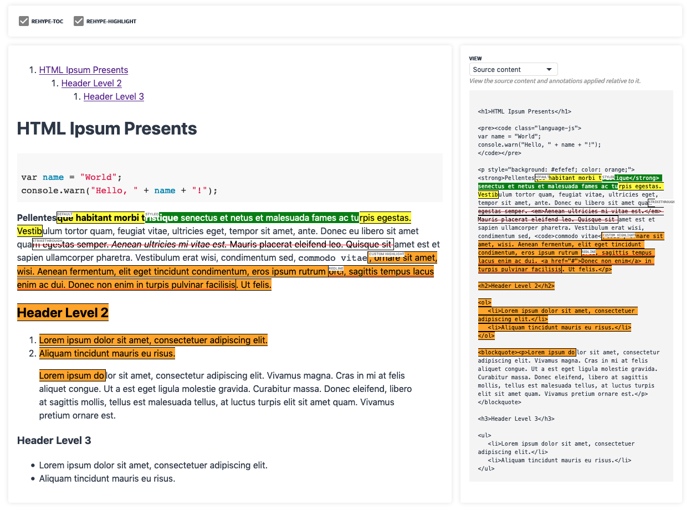

# react-unified-doc
React [**unified-doc**][unified-doc] renderer for content.




## Table of Contents
- [Install](#install)
- [Description](#description)
- [Props](#props)
- [Use](#use)
- [Docs](#docs)


## Install
```sh
yarn add @unified-doc/react-unified-doc
```

## Description
`react-unified-doc` provides a [React][react] wrapper around the [**unified-doc**][unified-doc] project to render content.  It uses the [unified][unified] ecosystem to parse, transform and render content through [rehype][rehype] plugins.  Supported source content (`text`, `markdown`, `html`) is parsed into a [hast][hast] tree which is then marked up with React into a safely sanitized HTML document.  This document is *non-opinionated* and maintains *high fidelity* with the source content, and supports easy customizations with standard web technologies.

Annotating documents is easily accomplished by declaratively specifying the `annotations` prop. The annotation algorithm is a pure *semantic addition* to the document converting matching `text` nodes into `<mark />` tags, and leaves the rest of the document unchanged.  An annotation is an object containing the following information:
- `startOffset`, `endOffset`: positional string offsets relative to the source content.
- `classNames`, `style`: ways to customize the annotated nodes.
- `anchor`, `label`: support features such as anchor permalinks or rendering a label for the annotation.
- any other data that is useful for working with annotation callbacks.

Various annotation callbacks (click, hover, tooltips), and text-selection callbacks allow for building interactive applications involving rendering and annotating documents.

`react-unified-doc` is a part of the [unified][unified] ecosystem, which allows it to benefit from many plugins.  It accepts [rehype][rehype] plugins via the `rehypePlugins` prop to enrich documents with additional features.


## Props
For a more detailed overview, please refer to the formal [props][props] documentation.

```ts
interface Props {
	/** Source content represented as a string */
	content: string;
	/** Supported content type ('html', 'markdown', 'text') */
	contentType?: ContentType;
	/** An array of annotations to apply to the content */
	annotations?: Annotation[];
	/** Provide optional CSS to style the document */
	className?: string;
	/** Valid rehype plugins can be applied after annotations.  Note that this will disable the `onSelectText` callback because we can no longer guarantee accurate text positions since other plugins may mutate the tree. */
	rehypePlugins?: Plugin[];
	/** HTML Sanitize schema (see https://github.com/syntax-tree/hast-util-sanitize#schema) */
	sanitizeSchema?: { [key: string]: any };
	/** Renders annotation tooltips when hovering on the annotation */
	getAnnotationTooltip?: (annotation: Annotation) => string;
	/** Callback to capture annotation object and mouse click event */
	onAnnotationClick?: AnnotationCallback;
	/** Callback to capture annotation object and mouse enter event */
	onAnnotationMouseEnter?: AnnotationCallback;
	/** Callback to capture annotation object and mouse leave event */
	onAnnotationMouseLeave?: AnnotationCallback;
	/** Callback to capture selected text and mouse up event.  The `SelectedText` extends the `Annotation` object, and can be used to updated the `annotations` prop in a controlled manner.  This callback is disabled if `rehypePlugins` are specifieds */
	onSelectText?: (selectedText: SelectedText, e?: MouseEvent) => void;
}
```


## Use
```js
import Document from 'react-unified-doc';
import toc from 'rehype-toc';

const content = '<blockquote>Blockquote with <b>bold</b> content.</blockquote>';
const annotations = [
	{ id: 'a1', startOffset: 0, endOffset: 30, label: 'annotation', tooltip: 'cool!' },
];

import './my-document.css';

function MyDocument() {
	return (
		<Document
			annotations={annotations}
			className="custom-doc-classname"
			content={content}
			contentType="html"
			getAnnotationTooltip={annotation => annotation.tooltip}
			rehypePlugins={[toc]}
			onAnnotationClick={annotation => console.log(annotation.id, ' clicked')}
			onAnnotationMouseEnter={annotation => console.log(annotation.id, ' hovered')}
			onSelectText={annotation => console.log(annotation.value, ' selected')}
		/>
	);
}
```


## Docs
View the official docs and examples at https://unified-doc.netlify.com/react-unified-doc/readme.

You can also run the docs locally:

```sh
git clone git@github.com:chrisrzhou/unified-doc

cd unified-doc
yarn && yarn docs
```


<!-- Links -->
[hast]: https://github.com/syntax-tree/hast
[props]: https://unified-doc.netlify.com/react-unified-doc/props
[react]: https://github.com/facebook/react
[rehype]: https://github.com/rehypejs
[unified]: https://unifiedjs.com/
[unified-doc]: https://github.com/chrisrzhou/unified-doc

<!-- Hack to make importing mdx work in docz/gatsby... -->
export default ({ children }) => children
