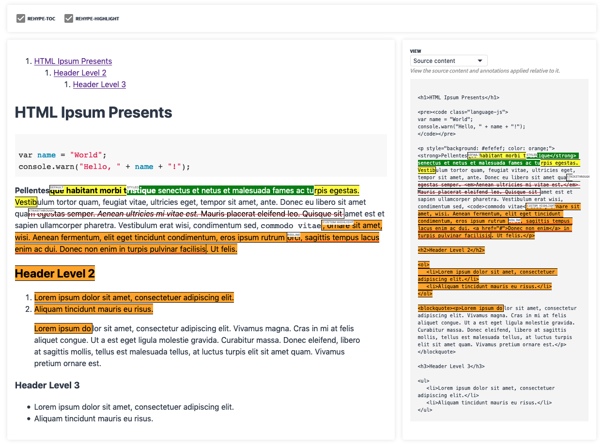

# unified-doc-react
React [**unified-doc**][unified-doc] renderer for content.




## Contents
- [Install](#install)
- [Description](#description)
- [Props](#props)
- [Use](#use)
- [Docs](#docs)


## Install
```sh
yarn add unified-doc-react
```

## Description
`unified-doc-react` provides a [React][react] wrapper around the [**unified-doc**][unified-doc] project to render content.  It uses the [unified][unified] ecosystem to parse, transform and render content through [rehype][rehype] plugins.  Supported source content (`text`, `markdown`, `html`) is parsed into a [hast][hast] tree which is then marked up with React into a safely sanitized HTML document.  This document is *non-opinionated* and maintains *high fidelity* with the source content, and supports easy customizations with standard web technologies.

Annotating documents is easily accomplished by declaratively specifying the `annotations` prop. The annotation algorithm is a pure *semantic addition* to the document converting matching `text` nodes into `<mark />` tags, and leaves the rest of the document unchanged.  An annotation is an object containing the following information:
- `id`: unique ID to identify the annotation.  Useful for assigning unique ID to the rendered DOM element.
- `startOffset`, `endOffset`: positional string offsets relative to the source content.
- `classNames`, `style`: ways to customize the annotated nodes.
- `label`: render label above the annotated node.
- any other data that is useful for working with annotation callbacks.

Various annotation callbacks (click, hover, tooltips), and text-selection callbacks allow for building interactive applications involving rendering and annotating documents.

`unified-doc-react` is a part of the [unified][unified] ecosystem, which allows it to benefit from many plugins.  It accepts [rehype][rehype] plugins via the `rehypePlugins` prop to enrich documents with additional features.


## Props
For a more detailed overview, please refer to the formal [props][props] documentation.

```ts
interface Props {
	/** Source string content */
	content: string;
	/** Supported content types (e.g. 'html', 'markdown', 'text') */
	contentType?: ContentType;
	/** Annotations applied relative to the source content */
	annotations?: Annotation[];
	/** Callbacks to capture annotation and related mouse events */
	annotationCallbacks?: AnnotationCallbacks;
	/** Optional CSS to style the document */
	className?: string;
	/** Optional rehype plugins can be applied.  Note that the `onSelectText` prop may misbehave if plugins modify the text content of the document. */
	rehypePlugins?: Plugin[];
	/** HTML Sanitize schema (https://github.com/syntax-tree/hast-util-sanitize#schema) */
	sanitizeSchema?: { [key: string]: any };
	/** Callback to capture selected text and mouse up event.  The `SelectedText` extends the `Annotation` object, and can be used with the `annotations` prop in a controlled manner.  Note that this callback may not behave correctly if rehype plugins modify the text content of the document since the callback is applied in relation to the source content. */
	onSelectText?: (selectedText: SelectedText, e?: MouseEvent) => void;
}
```


## Use
```js
import Document from 'unified-doc-react';
import toc from 'rehype-toc';

// include optional CSS for customizing mark styles
import 'unified-doc/src/index.css';

const content = '<blockquote>Blockquote with <b>bold</b> content.</blockquote>';
const annotations = [
	{ id: 'a1', startOffset: 0, endOffset: 30, label: 'annotation', tooltip: 'cool!' },
];

import './my-document.css';

function MyDocument() {
	const annotationCallbacks = {
		getTooltipContent: annotation => annotation.tooltip,
		onClick: annotation => console.log(annotation.id, ' clicked'),
		onMouseEnter: annotation => console.log(annotation.id, ' hovered'),
	};

	return (
		<Document
			annotations={annotations}
			annotationCallbacks={annotationCallbacks}
			className="custom-doc-classname"
			content={content}
			contentType="html"
			rehypePlugins={[toc]}
			onSelectText={annotation => console.log(annotation.value, ' selected')}
		/>
	);
}
```


## Docs
View the official docs and examples at https://unified-doc.netlify.com/unified-doc-react/readme.

You can also run the docs locally:

```sh
git clone git@github.com:chrisrzhou/unified-doc

cd unified-doc
yarn && yarn docs
```


<!-- Links -->
[hast]: https://github.com/syntax-tree/hast
[props]: https://unified-doc.netlify.com/unified-doc-react/props
[react]: https://github.com/facebook/react
[rehype]: https://github.com/rehypejs
[unified]: https://unifiedjs.com/
[unified-doc]: https://github.com/chrisrzhou/unified-doc
