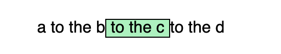
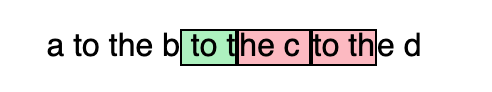

# unified-doc-util-annotate

[hast][hast] utility to annotate text nodes.

## Install

```bash
npm install unified-doc-util-annotate
```

## Description

This utility goes through all text nodes in a `hast` tree and annotates nodes that overlap with a provided array of annotations.

The annotation algorithm is focused on preserving the structure of the tree, and annotations are applied as `<mark />` elements immediately above the text nodes. The annotation process is data-driven and declarative.  Features are easily supported by specifying simple data on the annotation object.  At a high level, an `Annotation` object contains the following data:

- `id`: unique ID to identify the annotation.  It is also used to uniquely assign ID values to generated `<mark />` elements which is convenient for selecting the element itself.
- `startOffset`, `endOffset`: positional string offsets relative to the source content.  These offsets can be conveniently generated by various search highlighters (e.g. [Elasticsearch unified-highlighter][elasticsearch-unified-highlighter]).
- `classNames`, `style`: ways to customize the annotated nodes.
- `label`: support rendering a label above the annotated node.
- any other data that is useful for working with annotation callbacks.

One powerful feature of the utility is the ability to work with simple annotations defined by offset ranges relative to the source content, and allow the annotation algorithm to take care of annotating the text nodes without breaking the tree structure or affecting the semantics of the rendered document.  The following example demonstrates how the utility correctly handles annotation offset ranges that "cut off" the source HTML.

```js
const content =
  "<blockquote>This is a blockquote with <b>bold</b> text</blockquote>";
const annotations = [{ startOffset: 5 }, { endOffset: 43 }];
const substringApplyingOffsets = "<blockquote>This is a blockquote with <b>bol"; // naively rendering this leads to broken trees
const expectedAnnotatedSubstrings = ["This is a blockquote with ", "bol"];

const actualAnnotatedNodes = {
  // preserves the original tree structure
  type: "element",
  tagName: "blockquote",
  children: [
    {
      type: "element",
      tagName: "mark", // annotated
      children: [{ type: "text", value: "This is a blockquote with " }],
    },
    {
      type: "element",
      tagName: "b",
      children: [
        {
          type: "element",
          tagName: "mark", // annotated
          children: [{ type: "text", value: "bol" }],
        },
        {
          type: "text",
          value: "d",
        },
      ],
    },
    {
      type: "text",
      value: " text",
    },
  ],
};
```

## Use

### Simple

```js
const tree = {
  type: "root",
  children: [
    {
      type: "text",
      value: "a to the b to the c to the d",
      position: {
        start: {
          offset: 0,
        },
        end: {
          offset: 28,
        },
      },
    },
  ],
};

const annotations = [{ id: "a", startOffset: 10, endOffset: 20 }];
const annotated = annotate(tree, annotations);
```

Yields



```js
const annotated = {
  type: "root",
  children: [
    {
      type: "text",
      value: "a to the b",
    },
    {
      type: "element",
      tagName: "mark",
      // tracks relevant annotation metadata
      properties: {
        dataAnnotationId: "a",
        dataAnnotationStart: true,
        id: "a", // annotation ID used as a unique ID for the mark element if dataAnnotationStart is true
        dataAnnotationEnd: true,
      },
      children: [
        {
          type: "text",
          value: " to the c ",
        },
      ],
    },
    {
      type: "text",
      value: "to the d",
    },
  ],
};
```

### Overlapping Annotations

The utility also supports resolving overlapping annotations as demonstrated in the example below.

```js
const annotations = [
  { id: "a", startOffset: 10, endOffset: 20 },
  { id: "b", startOffset: 15, endOffset: 25 },
];
const annotated = annotate(tree, annotations); // same tree in the example above
```

Yields:



```js
const annotated = {
  type: "root",
  children: [
    {
      type: "text",
      value: "a to the b", // not annotated
    },
    {
      type: "element",
      tagName: "mark",
      properties: {
        dataAnnotationId: "a", // dataAnnotationId indicates this belongs to "a"
        dataAnnotationStart: true,
        id: "a", // annotation ID used as a unique ID for the mark element if dataAnnotationStart is true
        dataAnnotationEnd: true,
      },
      children: [
        {
          type: "text",
          value: " to t", // annotated once ("a")
        },
      ],
    },
    {
      type: "element",
      tagName: "mark",
      properties: {
        dataAnnotationId: "a", // dataAnnotationId indicates this belongs to "a"
        dataAnnotationEnd: true,
      },
      children: [
        {
          type: "element",
          tagName: "mark",
          properties: {
            dataAnnotationId: "b", // dataAnnotationId indicates this belongs to "b"
            dataAnnotationStart: true,
            id: "b", // annotation ID used as a unique ID for the mark element if dataAnnotationStart is true
            dataAnnotationEnd: true,
          },
          children: [
            {
              type: "text",
              value: "he c ", // annotated/nested twice ("a + b")
            },
          ],
        },
      ],
    },
    {
      type: "element",
      tagName: "mark",
      properties: {
        dataAnnotationId: "b", // dataAnnotationId indicates this belongs to "b"
        dataAnnotationEnd: true,
      },
      children: [
        {
          type: "text",
          value: "to th", // annotated once ("b")
        },
      ],
    },
    {
      type: "text",
      value: "e d", // not annotated
    },
  ],
};
```

## API

```ts
function annotate(
  tree: Node,
  annotations: Annotation[],
  annotationCallbacks?: Optional<AnnotationCallbacks>,
): Node;
```

When `annotationCallbacks` are provided, annotations can be captured on the corresponding mouse events (`onClick`, `onMouseEnter`, `onMouseOut`). You can also provide customize tooltip content by using the `setTooltipContent` callback.

### Interfaces

```ts
interface Annotation {
  /** Additional annotation data */
  [key: string]: any;
  /** Unique ID is required for annotation algorithm to work.  It is also used to uniquely assign ID values to generated <mark /> nodes which is convenient for selecting the element itself. */
  id: string;
  /** Start offset relative to the source content */
  startOffset: number;
  /** End offset relative to the source content */
  endOffset: number;
  /** CSS classnames that will be applied on the annotated nodes */
  classNames?: string[];
  /** If true, will add the value to the `label` tag attribute.  Useful for displaying the label with custom CSS:before selectors. */
  label?: string;
  /** Apply custom styles to the annotated node. Note that use of `classNames` prop is preferred. */
  style?: any;
}

type AnnotationCallback = (
  annotation: Annotation,
  event?: MouseEvent,
) => void;

interface AnnotationCallbacks {
  setTooltipContent: (annotation: Annotation) => string;
  onClick: AnnotationCallback;
  onMouseEnter: AnnotationCallback;
  onMouseOut: AnnotationCallback;
}
```

<!-- Links -->

[hast]: https://github.com/syntax-tree/hast
[elasticsearch-unified-highlighter]: https://www.elastic.co/guide/en/elasticsearch/reference/6.8/search-request-highlighting.html#unified-highlighter
