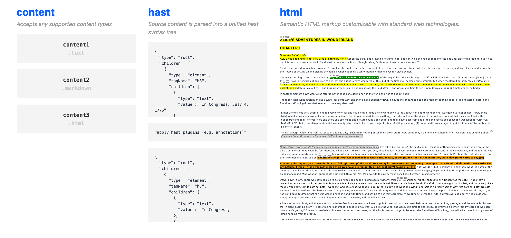

# 📜 unified-doc
[unified][unified] document renderer for content.

## Table of Contents
- [Motivations](#motivations)
- [Architecture](#architecture)
  - [Content](#content)
  - [Annotations](#annotations)
  - [Plugins](#plugins)
- [unified](#unified)
- [Contribute](#contribute)

## Motivations

> Content as structured data. -- [unified][unified]

Knowledge is *unified abstractly* across humanity.  We share common goals of acquiring, storing, and sharing knowledge.  Content represents the physical manifestation of storing knowledge, and is stored in various digital formats in the modern computing age.  Sharing content seamlessly across formats is a current challenge in unifying human knowledge.

Various softwares act on content types to parse, process, and render the underlying data for human consumption.  Many solutions try to be interoperable, but are largely limited by the lack of a common interface across content types and programs.  These solutions can be largely described as *API interactions between software, but not as interactions with the actual content*.  The [unified][unified] initiative addresses this problem by representing content in unified syntax tress where programs can work closely with the underlying structured content.

[**unified-doc**][unified-doc] is a project of unified document renderers and associated utilities, that use the [unified][unified] ecosystem to render any supported content types into HTML-based markup.  It represents content as structured data, and preserves fidelity of the original source content in the rendered document, all at the same time supporting powerful features that enrich the document (e.g. annotations), and remaining interoperable with standard and evolving web technologies.

## Architecture

The following section covers the design of how `unified-doc` renderers and programs are implemented.

### Content
At the time of writing, `unified-doc` supports parsing the following content types into [hast][hast] trees:

- `text`
- `markdown`
- `html`

This is done through the [`processor`][processor] module which provides a single entry point to define how supported content types are parsed into `hast` trees.  `processor` applies an opinionated (but configurable) sanitization step using the [`hast-util-sanitize`][hast-util-sanitize] utility.

Now that the source content is represented as unified `hast` tree, everything downstream can be consistently implemented.  Let's talk about compiling and rendering the `hast` tree into an actual `document`.

### Document
The term `document` refers abstractly to the output of compiling and rendering the `hast` tree.  This output should be a HTML-based markup  to support easy methods to further enrich the document with available web technologies.  `unified-doc` supports the following renderers:
- [`react-unified-doc`][react-unified-doc]

Renderers should use the `processor` module internally so that it can support all content types that `processor` supports.  It can optionally include [rehype][rehype] plugins depending on features to be supported.  `react-unified-doc` uses the [`hast-util-annotate`][hast-util-annotate] utility to support annotation features on `hast` trees processed by `processor`.

### Annotations

One of the more important and useful features when rendering documents is supporting annotations.  Here are some use cases of annotations in common document workflows:
- *Highlighting*: Text content is highlighted in the document with custom styles.  This is the broadest domain and there are many UIUX implementations to tailored for specific document workflows.
- *Bookmarking*: Loading a document with a and clicking on a valid anchor link will scroll to the bookmarked annotation.
- *Commenting*: Clicking on an annotation loads associated comments.
- *Redlining*: Text content is underlined, showing the difference between two versions of the document.

> **Definition**: An `annotation` represents **text content** that is **visibly marked** to the user and **does not disrupt** the rest of the document layout.

The definition above is intentionally worded to emphasize the following:
- **text content**: Only text content is meaningful to the viewer.  For HTML-based markup, this is semantically represented by `text` nodes.
- **visibly marked**: annotated text nodes should apply visual cues indicating they are annotated or 'marked'.  For HTML-based markup, this is represented semantically by `mark` nodes, and visual customizations of these nodes is important in conveying annotation information.
- **does not disrupt**: annotations should be *pure semantic additions* to the document without affecting the rendered document.

Annotations should support intuitive user interactions (e.g. clicking, hovering).  These interactions allow building useful features that enrich the document (e.g. tooltips, permalinks, updating annotations).

> Note: As mentioned earlier, it is important to view annotations as a **pure additive** operation when rendering documents.  Annotation implementations should never couple the rendering of documents and annotations nor affect the document layout.  This ensures that downstream applications of plugins and web technologies work seamlessly.

The above requirements and design choices are implemented in [`hast-util-annotate`][hast-util-annotate], which is a `hast` utility that powers annotation features in renderers such as [`react-unified-doc`][react-unified-doc].

### Plugins
Just as all content and programs are interoperable in the [unified][unified] ecosystem, the `unified-doc` renderers should be compatible with the [rehype][rehype] plugin ecosystem.  See the `react-unified-doc` [plugins docs][plugins] for an example on how this is achieved.

## unified
This project is built on top of the [unified][unified] ecosystem.  Please check out all the inspirational and ambitious projects happening there!

## Contribute
Help contribute towards making content and knowledge more accessible for machines and humans.

There are no formal contribution guidelines yet.  Be respectful and nice!

Useful infomation about the project:
- The project is linted with `xo` with some custom configuration.
- While the project uses `typescript`, it is not a `typescript` project and uses it purely to aid development.  This is intentional to make the code more accessible to the broader JS community.
- Tests are managed with `jest`.
- Docs are managed with `docz`.
- Todos:
	- [ ] `mark` and whitespace text nodes may not always be valid child elements (e.g. invalid with `tr`, `tbody`).  May need to consider using `span` (not-ideal), or potentially ignore the React DOM nesting errors.
  - [ ] Cypress tests for `react-unified-doc`.
  - [ ] Jest tests for `get-annotated-nodes` in `hast-util-annotate`.
	- [ ] Resolve XO/TS suppressed lint errors, and TODO comments
	- [ ] Improve Typescript typings.
  - [ ] Export useful annotation utilities for `react-unified-doc`.
  - [ ] Revisit/formalize `hast-util-coerce-text-positions`, `text-parse` implementations.
  - [ ] Review/feedback from [unified][unified] team.

<!-- Links -->
[hast]: https://github.com/syntax-tree/hast
[hast-util-sanitize]: https://github.com/syntax-tree/hast-util-sanitize
[hast-util-annotate]: https://github.com/chrisrzhou/unified-doc/tree/master/packages/hast-util-annotate
[plugins]: https://unified-doc.netlify.com/react-unified-doc/plugins
[position]: https://github.com/syntax-tree/unist#position
[processor]: https://github.com/chrisrzhou/unified-doc/tree/master/packages/processor
[props]: https://unified-doc.netlify.com/react-unified-doc/props
[react]: https://github.com/facebook/react
[react-unified-doc]: https://github.com/chrisrzhou/unified-doc/tree/master/packages/react-unified-doc
[rehype]: https://github.com/rehypejs
[unified]: https://unifiedjs.com/
[unified-doc]: https://github.com/chrisrzhou/unified-doc
